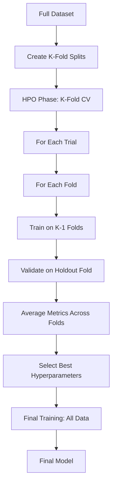

# K-Fold Cross-Validation Guide

## Overview

This project implements k-fold cross-validation for hyperparameter optimization (HPO) and final model training. The strategy uses nested cross-validation: k-fold CV for HPO evaluation, then trains the final model on all data with the best hyperparameters.

## Architecture



## Key Concepts

### Document-Level Splitting

Splits are performed at the **document level**, not token level, to prevent data leakage. Each document (resume sample) stays entirely in one fold.

### Nested Cross-Validation

1. **HPO Phase**: Uses k-fold CV to evaluate hyperparameter configurations
   - Each trial trains k models (one per fold)
   - Returns average validation metric across folds
   - More robust hyperparameter selection

2. **Final Training Phase**: Trains on **all data** without validation split
   - Uses best hyperparameters from HPO
   - No data leakage (validation data never seen during HPO)
   - Maximum data utilization for final model

## Configuration

### Enable K-Fold CV

Edit `config/hpo/smoke.yaml` or `config/hpo/prod.yaml`:

```yaml
k_fold:
  enabled: true
  n_splits: 5
  random_seed: 42
  shuffle: true
```

### Training Configuration

Edit `config/train.yaml`:

```yaml
k_fold:
  enabled: false  # Enable k-fold CV
  n_splits: 5
  random_seed: 42
  shuffle: true
  use_for_hpo: true  # Use CV for HPO evaluation
  use_for_final_training: false  # Final training uses all data
  save_splits: true  # Save fold splits for reproducibility
```

## Usage

### In Notebook

The local training notebook (`01_orchestrate_training_local.ipynb`) automatically:

1. Creates k-fold splits before HPO (if enabled)
2. Saves splits to `outputs/hpo/fold_splits.json` for reproducibility
3. Passes splits to HPO objective function
4. Displays CV statistics (mean ± std) for best trial
5. Uses all data for final training

### Manual Usage

#### Create Fold Splits

```python
from training.cv_utils import create_kfold_splits, save_fold_splits
from training.data import load_dataset

dataset = load_dataset("dataset/train.json")
train_data = dataset["train"]

splits = create_kfold_splits(
    dataset=train_data,
    k=5,
    random_seed=42,
    shuffle=True,
)

save_fold_splits(splits, Path("fold_splits.json"))
```

#### Train with Specific Fold

```python
# Train on fold 0
python src/training/train.py \
    --data-asset dataset \
    --config-dir config \
    --backbone distilbert \
    --fold-idx 0 \
    --fold-splits-file outputs/hpo/fold_splits.json
```

#### Final Training (All Data)

```python
# Train on all data without validation split
python src/training/train.py \
    --data-asset dataset \
    --config-dir config \
    --backbone distilbert \
    --use-all-data true
```

## Workflow Differences

### Without K-Fold CV (Default)

- HPO: Single train/validation split per trial
- Final Training: Uses combined train+validation data

### With K-Fold CV

- HPO: k-fold CV per trial (average metric across folds)
- Final Training: Uses all data (no validation split)

## Benefits

1. **Robust Hyperparameter Selection**: Average performance across folds reduces variance
2. **No Data Leakage**: Validation samples never appear in training during HPO
3. **Maximum Data Usage**: Final model trains on all available data
4. **Reproducible**: Saved fold splits ensure consistent CV across runs
5. **Better Generalization**: More reliable model performance estimates

## Performance Considerations

- **HPO Time**: Each trial takes k× longer (trains k models instead of 1)
- **Memory**: No additional memory overhead (folds trained sequentially)
- **Storage**: Fold splits saved to JSON (~few KB per split)

## Best Practices

1. **Use k=5**: Good balance between robustness and compute time
2. **Fixed Random Seed**: Ensures reproducible splits across runs
3. **Save Splits**: Always save fold splits for reproducibility
4. **Document k Value**: Record k value used in experiment logs
5. **Compare CV vs Non-CV**: Run both to understand impact on model selection

## Stratified CV for Imbalanced NER

- Why: Entity types are highly imbalanced (SKILL dominates; EMAIL/PHONE rare). Stratified folds reduce the chance of missing rare entities in a fold.
- How: Use entity-presence labels per document (tuple of entity types present) as stratification labels.
- Config: `config/hpo/*.yaml` → `k_fold.stratified: true`
- Validation: After split, print per-fold entity counts to verify no entity type is missing.

## Troubleshooting

### Error: "Cannot create k folds with only n samples"

**Solution**: Reduce `n_splits` or increase dataset size. Minimum samples = k.

### Error: "Fold index out of range"

**Solution**: Ensure `fold_idx` is between 0 and k-1.

### CV Metrics Differ Significantly from Single Split

**Expected**: CV metrics may be lower (more conservative estimate). This is normal and indicates CV is working correctly.

## API Reference

### `create_kfold_splits()`

Create k-fold splits at document level.

**Parameters**:
- `dataset`: List of dataset samples
- `k`: Number of folds (default: 5)
- `random_seed`: Random seed for reproducibility (default: 42)
- `shuffle`: Whether to shuffle before splitting (default: True)

**Returns**: List of (train_indices, val_indices) tuples

### `save_fold_splits()`

Save fold splits to JSON file.

**Parameters**:
- `splits`: List of (train_indices, val_indices) tuples
- `output_path`: Path to save JSON file
- `metadata`: Optional metadata dictionary

### `load_fold_splits()`

Load fold splits from JSON file.

**Parameters**:
- `input_path`: Path to JSON file

**Returns**: Tuple of (splits, metadata)

## Checkpoint and Resume Compatibility

K-fold cross-validation is fully compatible with HPO checkpoint/resume functionality. When checkpointing is enabled:

- **Fold splits are preserved**: The same fold splits are used when resuming, ensuring consistency
- **Trial state is saved**: Each trial's fold-level results are saved in the checkpoint
- **Resume works seamlessly**: You can interrupt and resume k-fold CV HPO runs just like regular HPO

For more information, see [HPO Checkpoint and Resume Support](./HPO_CHECKPOINT_RESUME.md).

## Related Documentation

- [HPO Checkpoint and Resume Support](./HPO_CHECKPOINT_RESUME.md) - Checkpoint/resume functionality
- [Local Training Guide](LOCAL_TRAINING.md) - Complete local training workflow
- [Platform Adapter Architecture](PLATFORM_ADAPTER_ARCHITECTURE.md) - How platform adapters work


