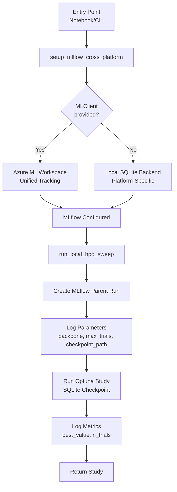
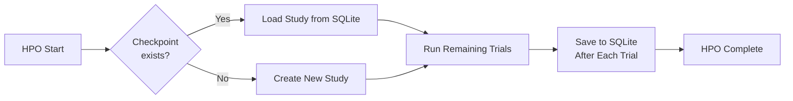

<!-- 61f5860e-af6e-42a5-ab2d-829707de90cc 164b5b0d-0741-4610-a3c7-0d54335a536a -->
# MLflow Azure Integration and HPO Checkpoint Enhancement

## Overview

### Purpose

This plan integrates Azure ML Workspace as a centralized MLflow tracking server for all jobs (HPO, training, conversion) across platforms (Colab, Kaggle, local, Azure), enabling unified experiment tracking. It also ensures SQLite-based HPO checkpoint storage and resume functionality is properly integrated with MLflow tracking.

**Why it matters**: Currently, MLflow tracking is platform-specific (file-based), making it impossible to view experiments across platforms. This plan enables unified tracking while maintaining backward compatibility and the existing SQLite checkpoint system.

### Scope

**In scope**

- Azure ML Workspace integration for MLflow tracking (all platforms)
- HPO-level MLflow run creation and tracking
- Platform-aware MLflow setup utility with Azure ML fallback
- Integration of checkpoint metadata into MLflow
- Backward compatibility (graceful fallback to local tracking)
- Documentation updates

**Out of scope**

- Training checkpoint resume (training always runs from scratch)
- Model artifact logging to MLflow (can be added later)
- Optuna MLflowCallback integration (can be added later)
- Changes to SQLite checkpoint storage mechanism (already works)

### Guiding Principles

- Single Responsibility Principle (SRP)
- Config-driven behavior (optional Azure ML integration)
- Backward compatibility (works without Azure ML)
- Platform-aware utilities (reuse existing patterns)
- Graceful degradation (fallback to local tracking)

## Goals & Success Criteria

### Goals

- G1: Enable unified MLflow tracking across all platforms via Azure ML Workspace
- G2: Add HPO-level tracking to MLflow (parent runs for HPO sweeps)
- G3: Integrate checkpoint metadata into MLflow for discoverability
- G4: Maintain backward compatibility (works without Azure ML)

### Success Criteria

- [ ] All platforms can use Azure ML Workspace for MLflow tracking
- [ ] HPO runs are tracked as parent runs in MLflow
- [ ] Checkpoint paths logged to MLflow for discoverability
- [ ] Graceful fallback to local tracking when Azure ML unavailable
- [ ] No breaking changes to existing functionality
- [ ] SQLite checkpoint system continues to work
- [ ] Documentation updated

## Current State Analysis

### Existing Behavior

**MLflow Tracking:**

- Notebooks set up file-based MLflow tracking (`file:///path/to/mlruns`)
- Each training trial creates individual MLflow run (via `train.py` subprocess)
- No HPO-level parent run in MLflow
- Platform-specific tracking (isolated per platform)

**HPO Checkpoints:**

- SQLite-based checkpoint system already implemented
- Platform-aware path resolution (Colab → Drive, Kaggle → `/kaggle/working`, Local → `output_dir`)
- Auto-resume functionality working
- Checkpoint config in HPO YAML files

**Azure ML Integration:**

- `_configure_mlflow()` exists in `selection.py` but only used for Azure ML jobs
- MLClient usage exists but not for local/Colab/Kaggle tracking

### Pain Points / Limitations

- L1: No unified view of experiments across platforms
- L2: No HPO-level tracking in MLflow (only individual trials)
- L3: Checkpoint paths not discoverable via MLflow
- L4: Manual MLflow setup required in each notebook

### Architectural Issues

- MLflow setup duplicated across notebooks
- No centralized utility for cross-platform MLflow configuration
- HPO orchestration doesn't create MLflow parent runs
- Checkpoint metadata not linked to MLflow

## High-Level Design

### Architecture Overview

```
┌─────────────────────────────────────────────────────────┐
│  Entry Points (Notebooks, CLI, Tests)                  │
└─────────────────────────────────────────────────────────┘
                        │
                        ▼
┌─────────────────────────────────────────────────────────┐
│  MLflow Setup Utility (Platform-Aware)                │
│  - Detects platform (Colab/Kaggle/Local/Azure)         │
│  - Configures Azure ML or local fallback               │
└─────────────────────────────────────────────────────────┘
                        │
        ┌───────────────┴───────────────┐
        ▼                               ▼
┌───────────────────┐         ┌───────────────────┐
│  Azure ML         │         │  Local Fallback   │
│  Workspace        │         │  (SQLite/File)    │
│  (Unified)        │         │  (Platform-Specific)│
└───────────────────┘         └───────────────────┘
        │                               │
        └───────────────┬───────────────┘
                        ▼
┌─────────────────────────────────────────────────────────┐
│  HPO Orchestration (run_local_hpo_sweep)                 │
│  - Creates MLflow parent run                            │
│  - Logs checkpoint metadata                             │
│  - Runs Optuna study (SQLite checkpoint)                │
└─────────────────────────────────────────────────────────┘
                        │
        ┌───────────────┴───────────────┐
        ▼                               ▼
┌───────────────────┐         ┌───────────────────┐
│  MLflow Tracking  │         │  SQLite Checkpoint│
│  (Metadata)       │         │  (Study State)    │
└───────────────────┘         └───────────────────┘
```

### Responsibility Breakdown

| Layer | Responsibility |

|-------|---------------|

| Entry Points | Initialize MLflow via utility, call HPO functions |

| MLflow Setup Utility | Platform detection, Azure ML configuration, fallback |

| HPO Orchestration | Create parent runs, log metadata, manage Optuna study |

| Checkpoint Manager | SQLite path resolution (unchanged) |

| MLflow | Experiment tracking, run metadata storage |

## Module & File Structure

### New Files to Create

- `src/shared/mlflow_setup.py` — Platform-aware MLflow configuration utility
  - `setup_mlflow_cross_platform()` — Main entry point
  - `_get_azure_ml_tracking_uri()` — Azure ML workspace URI resolution
  - `_get_local_tracking_uri()` — Local fallback (SQLite backend)

### Files to Modify

- `src/orchestration/jobs/local_sweeps.py`
  - Add MLflow parent run creation in `run_local_hpo_sweep()`
  - Set experiment name at start of function
  - Wrap study lifecycle in `mlflow.start_run()` context
  - Log checkpoint metadata to MLflow (even if disabled)
  - Log HPO-level metrics (best value, trial count)
  - Add try/except for graceful MLflow failure handling

- `src/orchestration/mlflow_utils.py`
  - Keep `setup_mlflow_for_stage()` unchanged (backward compatibility)
  - Add comment noting new `setup_mlflow_cross_platform()` for cross-platform use

- `docs/HPO_CHECKPOINT_RESUME.md`
  - Add section on MLflow integration
  - Document Azure ML workspace setup
  - Document local fallback behavior
  - Update usage examples with `setup_mlflow_cross_platform()`
  - Add troubleshooting section for MLflow issues

- `notebooks/01_orchestrate_training_colab.ipynb`
  - Replace file-based MLflow setup with `setup_mlflow_cross_platform()`
  - Add Azure ML client initialization (optional, with fallback)
  - Update documentation cells

- `notebooks/01_orchestrate_training_local.ipynb`
  - Replace file-based MLflow setup with `setup_mlflow_cross_platform()`
  - Add Azure ML client initialization (optional, with fallback)
  - Update documentation cells

### Files Explicitly Not Touched

- `src/orchestration/jobs/checkpoint_manager.py` — SQLite checkpoint logic unchanged
- `src/shared/platform_detection.py` — Platform detection unchanged
- `src/training/trainer.py` — Training checkpoint logic unchanged

## Detailed Design per Component

### Component: MLflow Setup Utility (`src/shared/mlflow_setup.py`)

**Responsibility (SRP)**

- Single responsibility: Configure MLflow tracking URI based on platform and available resources

**Inputs**

- `ml_client: Optional[MLClient]` — Azure ML client (if available)
- `experiment_name: str` — MLflow experiment name
- `fallback_to_local: bool = True` — Whether to fallback to local tracking

**Outputs**

- `str` — Tracking URI that was configured

**Public API**

```python
def setup_mlflow_cross_platform(
    experiment_name: str,
    ml_client: Optional[MLClient] = None,
    fallback_to_local: bool = True,
) -> str:
    """
    Setup MLflow for cross-platform tracking.
    
    If ml_client provided, uses Azure ML workspace (unified tracking).
    Otherwise, falls back to platform-specific local tracking (SQLite backend).
    
    Args:
        experiment_name: MLflow experiment name
        ml_client: Optional Azure ML client for unified tracking
        fallback_to_local: If True, fallback to local tracking when Azure ML fails
    
    Returns:
        Tracking URI string that was configured
    
    Raises:
        RuntimeError: If Azure ML required but unavailable and fallback disabled
    """
```

**Implementation Notes**

- Try Azure ML first if `ml_client` provided
- Import `azureml.mlflow` only when needed (graceful if missing)
- Use SQLite backend for local fallback (addresses deprecation warning)
- Platform-aware local paths (Colab → Drive if mounted, Kaggle → `/kaggle/working`, Local → `./mlruns`)
- Log which tracking method is being used

### Component: HPO MLflow Integration (`src/orchestration/jobs/local_sweeps.py`)

**Responsibility (SRP)**

- Create MLflow parent run for HPO sweep and log checkpoint metadata

**Inputs**

- Existing `run_local_hpo_sweep()` parameters
- MLflow already configured by caller

**Outputs**

- Optuna study (unchanged)
- MLflow parent run created with metadata

**Public API**

```python
# No API changes, internal implementation only
# Wraps study.optimize() in mlflow.start_run() context
```

**Implementation Notes**

- Create MLflow parent run at start of `run_local_hpo_sweep()`
- Use `run_name=f"hpo_{backbone}_{run_id}"` for unique identification
- Log parameters: `backbone`, `max_trials`, `checkpoint_path`, `study_name`
- Log metrics after completion: `best_value`, `n_trials`, `n_completed_trials`
- Handle resume case: log `resumed_from_checkpoint: true` if applicable
- Ensure MLflow is configured before creating run (caller responsibility)

### Component: Checkpoint-MLflow Integration

**Responsibility (SRP)**

- Link checkpoint paths to MLflow runs for discoverability

**Implementation Notes**

- Log `checkpoint_path` as MLflow parameter (absolute path)
- Log `checkpoint_storage_type: "sqlite"` for clarity
- Log `checkpoint_enabled: true/false` status
- This enables finding checkpoints via MLflow UI search

## Configuration & Controls

### Configuration Sources

- Environment variables: `AZURE_SUBSCRIPTION_ID`, `AZURE_RESOURCE_GROUP`, `AZURE_WORKSPACE_NAME`
- Optional MLClient parameter in function calls
- HPO config YAML (checkpoint section unchanged)

### Example Configuration

**Notebook setup (with Azure ML):**

```python
from azure.ai.ml import MLClient
from azure.identity import DefaultAzureCredential
from shared.mlflow_setup import setup_mlflow_cross_platform

# Initialize Azure ML client (optional)
ml_client = MLClient(
    credential=DefaultAzureCredential(),
    subscription_id=os.getenv("AZURE_SUBSCRIPTION_ID"),
    resource_group_name=os.getenv("AZURE_RESOURCE_GROUP"),
    workspace_name="resume-ner-ws"
)

# Setup MLflow (unified tracking)
setup_mlflow_cross_platform(
    experiment_name="my-experiment",
    ml_client=ml_client  # Optional: enables unified tracking
)
```

**Notebook setup (local fallback):**

```python
from shared.mlflow_setup import setup_mlflow_cross_platform

# Setup MLflow (platform-specific local tracking)
setup_mlflow_cross_platform(
    experiment_name="my-experiment"
    # No ml_client: uses local SQLite backend
)
```

**HPO config (unchanged):**

```yaml
checkpoint:
  enabled: true
  storage_path: "{backbone}/study.db"
  auto_resume: true
```

### Validation Rules

- `experiment_name`: Required, non-empty string
- `ml_client`: Optional, but if provided must be valid MLClient instance
- Azure credentials: Validated by Azure SDK (DefaultAzureCredential handles multiple auth methods)

## Implementation Steps

1. **Create MLflow setup utility** (`src/shared/mlflow_setup.py`)

   - Implement `setup_mlflow_cross_platform()`
   - Add Azure ML workspace URI resolution
   - Add local fallback with SQLite backend
   - Add unit tests

2. **Add HPO MLflow integration** (`src/orchestration/jobs/local_sweeps.py`)

   - Wrap study creation/optimization in `mlflow.start_run()`
   - Log HPO parameters and checkpoint metadata
   - Log final metrics after optimization
   - Handle resume case in logging

3. **Update notebooks** (Colab and Local)

   - Replace file-based MLflow setup with `setup_mlflow_cross_platform()`
   - Add optional Azure ML client initialization
   - Update documentation cells

4. **Update documentation** (`docs/HPO_CHECKPOINT_RESUME.md`)

   - Add MLflow integration section
   - Document Azure ML workspace setup
   - Add cross-platform tracking examples
   - Update troubleshooting section

5. **Add integration tests**

   - Test Azure ML setup (with mock MLClient)
   - Test local fallback
   - Test HPO MLflow run creation
   - Test checkpoint metadata logging

6. **Update existing tests**

   - Ensure tests work with new MLflow setup
   - Mock MLflow calls where needed

## Testing Strategy

### Unit Tests

- `test_mlflow_setup.py`
  - Test Azure ML workspace URI resolution
  - Test local fallback (all platforms)
  - Test SQLite backend creation
  - Test error handling (invalid MLClient, missing credentials)

### Integration Tests

- `test_hpo_mlflow_integration.py`
  - Test HPO parent run creation
  - Test checkpoint metadata logging
  - Test resume case logging
  - Verify MLflow run contains expected parameters/metrics

### Edge Cases

- Azure ML unavailable (network issues, invalid credentials)
- MLflow not installed (should fail gracefully with clear error)
- Checkpoint disabled (should still create MLflow run)
- Resume from checkpoint (verify correct metadata)

## Backward Compatibility & Migration

**What remains compatible:**

- SQLite checkpoint system (unchanged)
- HPO config YAML format (unchanged)
- `run_local_hpo_sweep()` function signature (unchanged)
- Existing notebooks work (with local fallback)

**Migration steps:**

1. Install/update Azure ML SDK: `pip install azure-ai-ml azure-identity`
2. Set environment variables (optional, for Azure ML)
3. Update notebooks to use `setup_mlflow_cross_platform()`
4. No changes required to HPO config files

**Deprecated behavior:**

- File-based MLflow tracking (still works but deprecated by MLflow)
- Manual MLflow setup in notebooks (replaced by utility)

## Documentation Updates

### New Documentation

- `docs/MLFLOW_TRACKING.md` (optional, if extensive)
  - Cross-platform MLflow setup guide
  - Azure ML workspace configuration
  - Troubleshooting MLflow issues

### Updated Documentation

- `docs/HPO_CHECKPOINT_RESUME.md`
  - Add "MLflow Integration" section
  - Document Azure ML workspace setup
  - Add cross-platform tracking examples
  - Update troubleshooting with MLflow issues

- `README.md` (if needed)
  - Mention unified MLflow tracking capability
  - Link to setup documentation

## Rollout & Validation Checklist

- [ ] MLflow setup utility implemented and tested
- [ ] HPO MLflow integration implemented
- [ ] Unit tests added and passing
- [ ] Integration tests added and passing
- [ ] Notebooks updated (Colab and Local)
- [ ] Documentation updated
- [ ] Tested on local platform
- [ ] Tested with Azure ML workspace (if available)
- [ ] Verified backward compatibility (works without Azure ML)
- [ ] Verified SQLite checkpoint system still works
- [ ] CI passing

## Appendix

### Architecture Diagram



### Example MLflow Run Structure

```
Experiment: resume_ner_baseline-hpo-distilbert
└── Run: hpo_distilbert_20241226_143022
    ├── Parameters:
    │   ├── backbone: distilbert
    │   ├── max_trials: 20
    │   ├── checkpoint_path: /path/to/study.db
    │   ├── checkpoint_enabled: true
    │   └── study_name: hpo_distilbert
    ├── Metrics:
    │   ├── best_value: 0.85
    │   ├── n_trials: 20
    │   └── n_completed_trials: 18
    └── Tags:
        └── resumed_from_checkpoint: false
```

### SQLite Checkpoint Flow (Unchanged)



### To-dos

- [x] Create src/shared/mlflow_setup.py with setup_mlflow_cross_platform() function supporting Azure ML workspace and local SQLite fallback
- [x] Add MLflow parent run creation and metadata logging to run_local_hpo_sweep() in src/orchestration/jobs/local_sweeps.py
- [x] Update notebooks (01_orchestrate_training_colab.ipynb and 01_orchestrate_training_local.ipynb) to use setup_mlflow_cross_platform() instead of file-based setup
- [x] Update docs/HPO_CHECKPOINT_RESUME.md with MLflow integration section, Azure ML setup instructions, and cross-platform examples
- [x] Add unit tests for mlflow_setup.py covering Azure ML setup, local fallback, and error handling
- [ ] Add integration tests for HPO MLflow integration verifying parent run creation and metadata logging